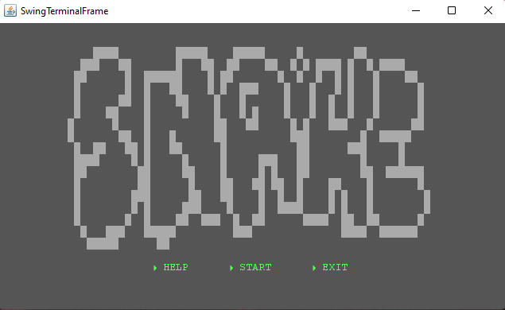

## LDTS_1504 - Snake2.0

 O objetivo deste projeto é recriar o jogo mundialmente conhecido, Snake, implementando algumas funcionalidas extra que permitam tornar o jogo mais apelativo, bem como incrementar a dificuldade do mesmo. 
 
 Este projeto está a ser desenvolvido, no âmbito da Unidade Curricular LDTS (Laboratório de Desenho e Teste de Software) do ano letivo 2021/2022, por:
 
• Bruno Leal (up202008047@fc.up.pt);

• Eduarda Araújo(up202004473@fc.up.pt);

• Guilherme Freire (up202004809@fe.up.pt).

### TO BE IMPLEMENTED FEATURES:

•	A cobra desloca-se de acordo com o input do utilizador;

•	Ao comer uma maçã, a cobra aumenta um bloco;

•	Determinadas maçãs, distinguíveis através da cor, dão determinados poderes à cobra;

•	No caso da cobra embater nos limites da arena, perde o jogo;

•	As maçãs aparecem em posições aleatórias;

•	Possibilidade de ter 2 utilizadores, em simultâneo, um contra o outro;

•	 Caso as duas cobras se cruzem, ambas perdem. Se o utilizador 1 for contra o utilizador 2, o jogador 1 perde;

•	Possibilidade de mudar a cor da cobra;

## Design

**Problema**

 No desonvolvimento do nosso projeto, apercebemo-nos que algumas classes continham muitos métodos distintos o que torna o código visualmente pouco apelativo.

**Solução**

 Planeamos usar o **"MVC Pattern"**. Este desing pattern consiste em subdividir o código em três grandes partes sendo estas:

1. Model - representa os dados;
2. View - dá display aos dados presentes em Model;
3. Controller - reage aos inputs do utilizador;

**Implementation**

(Por ser feito.)

---------------------------------------------------------------------------------------------------------------------------------------------------------------------------------
**Problema**

 Devido aos diferentes menus bem como estados da cobra, causados pela ingestão de maçãs, que pretendemos implementar, seria necessário uma grande quantidade de variáveis.

**Solução**

 Para solucionar este problema iremos aplicar o **"State Pattern"**, que permite alterar o comportamento de um determinado objeto quando este muda o seu estado.

**Implementation**

(Por ser feito.)

## KNOWN CODE SMELLS AND REFACTORING SUGGESTIONS

(Dado o pouco volume de código presente, ainda não nos apercebemos de nenhum code smell.)

## TESTING

 Pretendemos testar os movimentos da cobra, a geração das maçãs bem como a interação entre os dois. Mais tarde testaremos ainda as colisões das cobras com os limites da arena e entre dois utilizadores.
